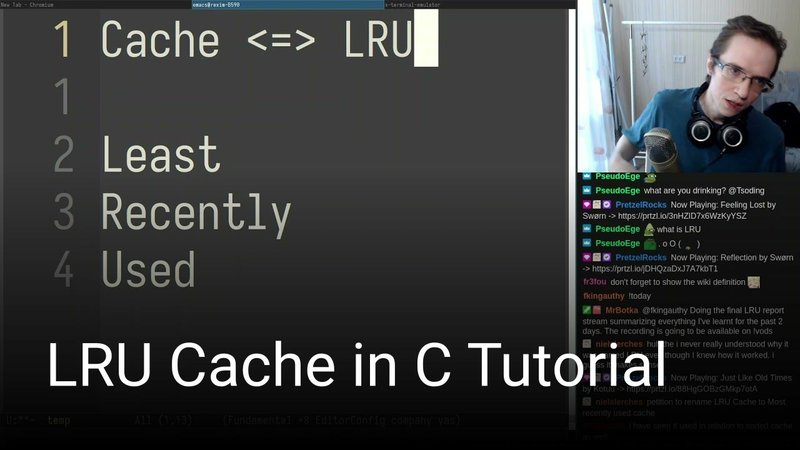

# LRU implementation exercises

## Quick Start

This project uses [nobuild](https://github.com/tsoding/nobuild) build system:

```console
$ cc -o nobuild nobuild.c
$ ./nobuild run
```

## Screencast

[](https://www.youtube.com/watch?v=Ud6lzJ_IWIU)
